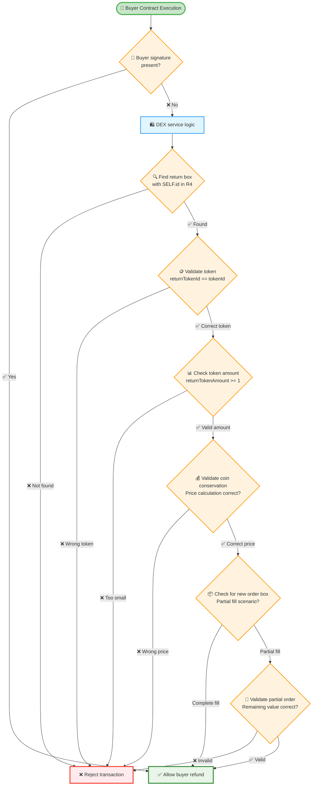
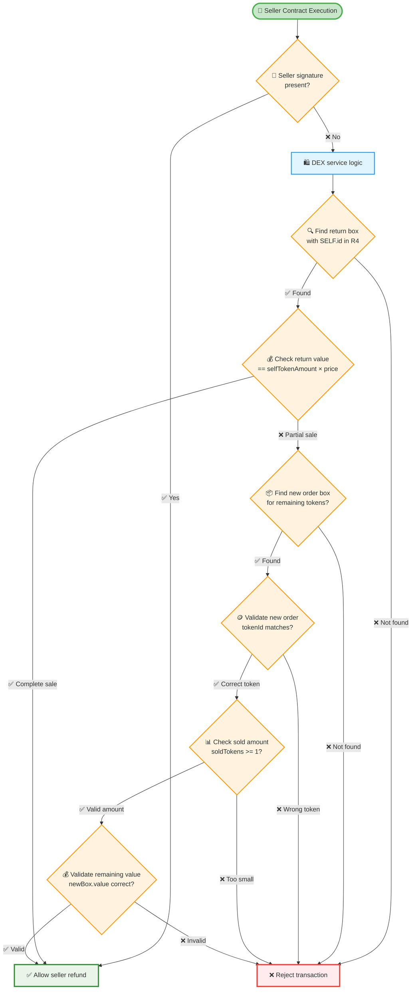
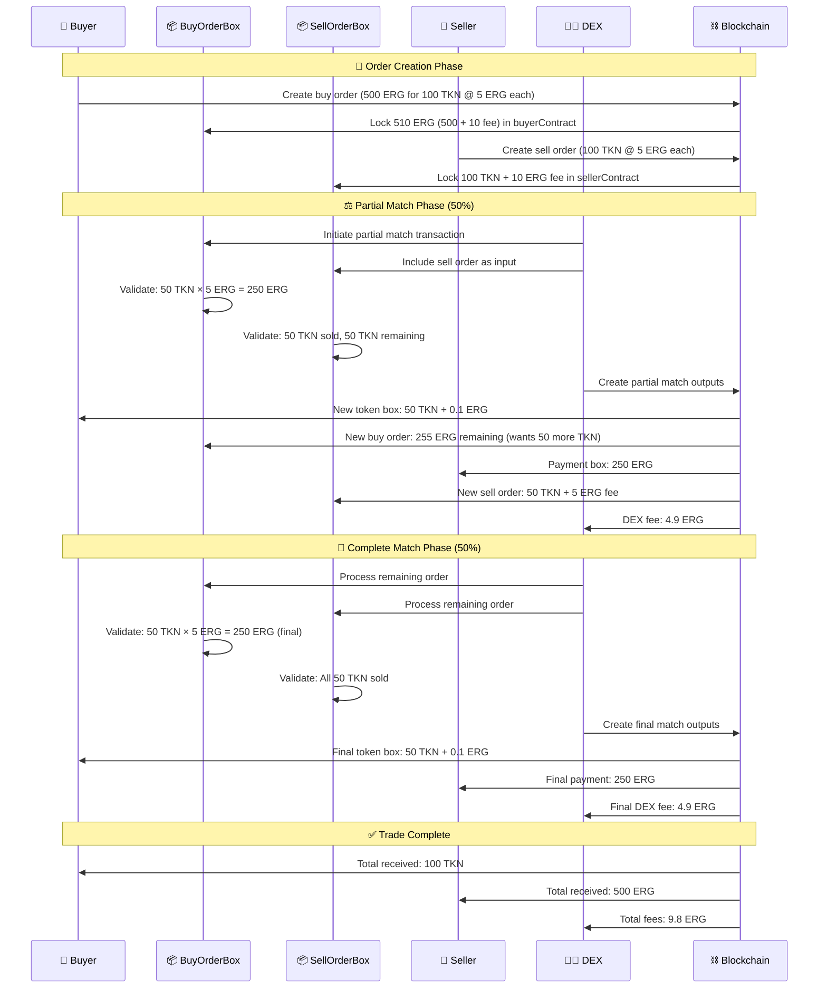
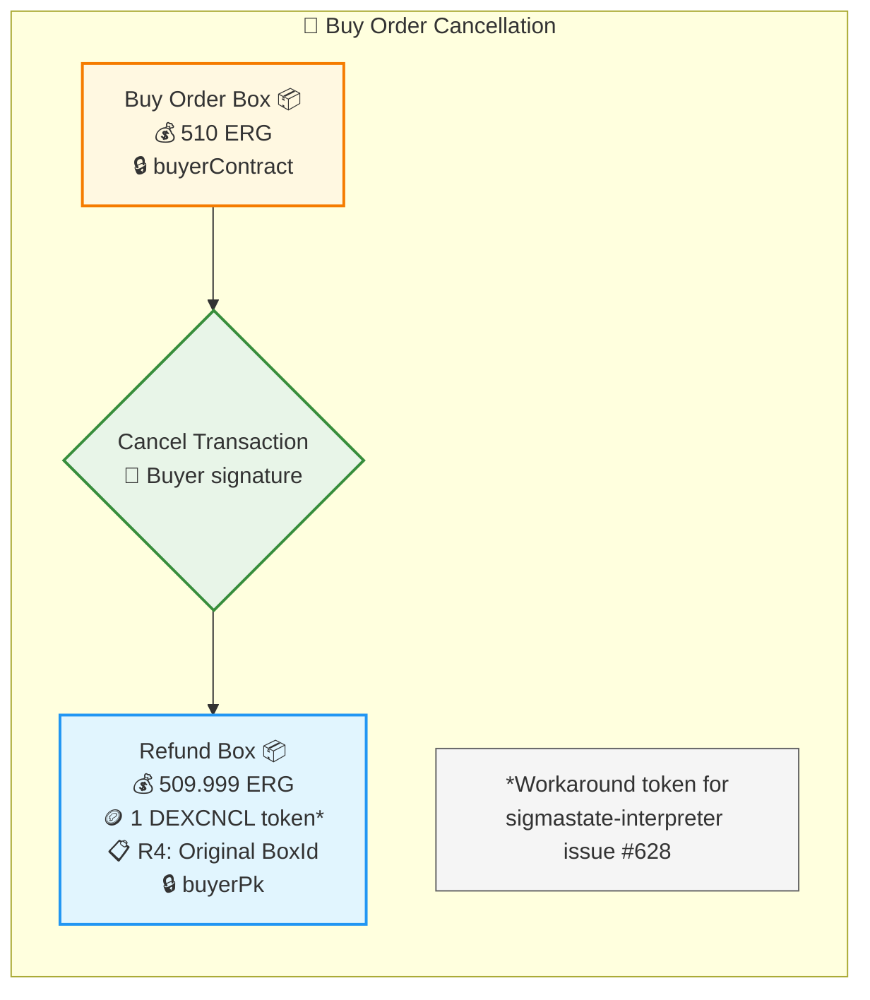
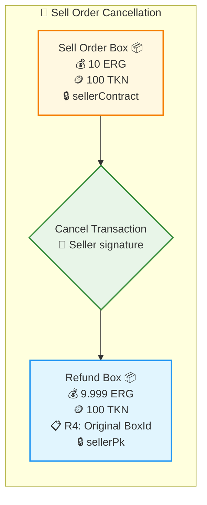
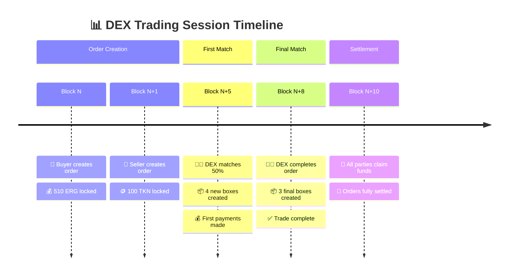

# DEX Playground - Complete Mermaid Visualization

This document demonstrates the complete Mermaid diagram system applied to the existing DEX playground contract, showing both partial and complete order matching scenarios.

## 1. DEX System Overview

```mermaid
graph TB
    %% Initial Parties Setup
    subgraph "🏦 Initial State"
        direction TB
        BP[👤 Buyer<br/>💰 510.01 ERG<br/>🎯 Wants: 100 TKN @ 5 ERG each]
        SP[👤 Seller<br/>💰 10.01 ERG<br/>🪙 100 TKN<br/>💸 Asks: 5 ERG per TKN]
        DP[👤 DEX Operator<br/>💰 Initial funds<br/>🔧 Matches orders]
    end
    
    %% Order Creation Phase
    subgraph "📝 Order Creation Phase"
        direction TB
        BP --> BCT{Create Buy Order<br/>📝 Fee: 0.001 ERG<br/>🎯 Bid: 500 ERG + 10 ERG fee}
        SP --> SCT{Create Sell Order<br/>📝 Fee: 0.001 ERG<br/>💰 Deposit: 10 ERG fee}
        
        BCT --> BO[Buy Order Box 📦<br/>💰 510 ERG (500 + 10 fee)<br/>📋 R4: BoxId reference<br/>🔒 buyerContract<br/>✅ Can refund to buyer<br/>✅ Can partial fill]
        
        SCT --> SO[Sell Order Box 📦<br/>💰 10 ERG (fee deposit)<br/>🪙 100 TKN<br/>📋 R4: BoxId reference<br/>🔒 sellerContract<br/>✅ Can refund to seller<br/>✅ Can partial fill]
    end
    
    %% Partial Matching Phase
    subgraph "⚖️ Partial Match (50 TKN)"
        direction TB
        BO --> PM1{Partial Match Tx<br/>👨‍💼 DEX processes<br/>📊 50% fill}
        SO --> PM1
        
        PM1 --> NBO[New Buy Order 📦<br/>💰 255 ERG (remaining)<br/>📋 R4: Previous BoxId<br/>🔒 buyerContract<br/>🎯 Still wants: 50 TKN]
        
        PM1 --> NSO[New Sell Order 📦<br/>💰 5 ERG (reduced fee)<br/>🪙 50 TKN (remaining)<br/>📋 R4: Previous BoxId<br/>🔒 sellerContract]
        
        PM1 --> BT1[Buyer Tokens 📦<br/>💰 0.1 ERG (min value)<br/>🪙 50 TKN<br/>📋 R4: Source BoxId<br/>🔒 buyerPk]
        
        PM1 --> SP1[Seller Payment 📦<br/>💰 250 ERG<br/>📋 R4: Source BoxId<br/>🔒 sellerPk]
        
        PM1 --> DF1[DEX Fee 📦<br/>💰 4.9 ERG<br/>🔒 dexPk]
    end
    
    %% Complete Matching Phase  
    subgraph "🎯 Complete Match (Remaining 50 TKN)"
        direction TB
        NBO --> CM{Complete Match Tx<br/>👨‍💼 DEX processes<br/>✅ 100% filled}
        NSO --> CM
        
        CM --> BT2[Final Buyer Tokens 📦<br/>💰 0.1 ERG<br/>🪙 50 TKN<br/>📋 R4: Source BoxId<br/>🔒 buyerPk]
        
        CM --> SP2[Final Seller Payment 📦<br/>💰 250 ERG<br/>📋 R4: Source BoxId<br/>🔒 sellerPk]
        
        CM --> DF2[Final DEX Fee 📦<br/>💰 4.9 ERG<br/>🔒 dexPk]
    end
    
    %% Final State
    subgraph "🎉 Final Balances"
        direction TB
        BF[👤 Buyer Final<br/>💰 0.2 ERG (change)<br/>🪙 100 TKN<br/>✅ Order completely filled]
        
        SF[👤 Seller Final<br/>💰 500 ERG (sales proceeds)<br/>🪙 0 TKN<br/>✅ All tokens sold]
        
        DF_FINAL[👤 DEX Final<br/>💰 9.8 ERG (fees collected)<br/>💼 Successful matching]
    end
    
    BT1 --> BF
    BT2 --> BF
    SP1 --> SF
    SP2 --> SF
    DF1 --> DF_FINAL
    DF2 --> DF_FINAL
    
    %% Styling
    classDef participantStyle fill:#e3f2fd,stroke:#1976d2,stroke-width:2px
    classDef orderStyle fill:#fff8e1,stroke:#f57c00,stroke-width:2px
    classDef transactionStyle fill:#e8f5e8,stroke:#388e3c,stroke-width:3px
    classDef payoutStyle fill:#f3e5f5,stroke:#7b1fa2,stroke-width:2px
    classDef finalStyle fill:#c8e6c9,stroke:#4caf50,stroke-width:3px
    
    class BP,SP,DP participantStyle
    class BO,SO,NBO,NSO orderStyle
    class BCT,SCT,PM1,CM transactionStyle
    class BT1,SP1,DF1,BT2,SP2,DF2 payoutStyle
    class BF,SF,DF_FINAL finalStyle
```

## 2. Contract Logic Decision Trees

### Buyer Contract Logic Flow



### Seller Contract Logic Flow  



## 3. Sequence Diagram - Complete Trading Flow



## 4. Order Cancellation Scenarios

### Buy Order Cancellation



### Sell Order Cancellation



## 5. Fee Flow Analysis

```mermaid
sankey-beta
    %% DEX Fee Distribution
    Buyer Order Fee,DEX Revenue,10
    Seller Order Fee,DEX Revenue,10  
    Buyer Match Fee,DEX Revenue,5
    Seller Match Fee,DEX Revenue,5
    Transaction Fees,Network,0.003
    
    DEX Revenue,DEX Operator,30
    DEX Revenue,Protocol Development,0
    DEX Revenue,Liquidity Incentives,0
```

## 6. State Transitions Timeline



This comprehensive visualization system demonstrates how the Mermaid templates can be applied to document any Ergo smart contract pattern. The DEX example shows:

- **Complete transaction flows** with actual values
- **Contract logic validation** paths  
- **Multi-phase interactions** (partial/complete matching)
- **Error handling** scenarios (cancellations)
- **Economic analysis** (fee distribution)
- **Timeline visualization** for complex processes

The same template system can be applied to any Ergo contract by substituting the relevant parameters and customizing the logic flows.