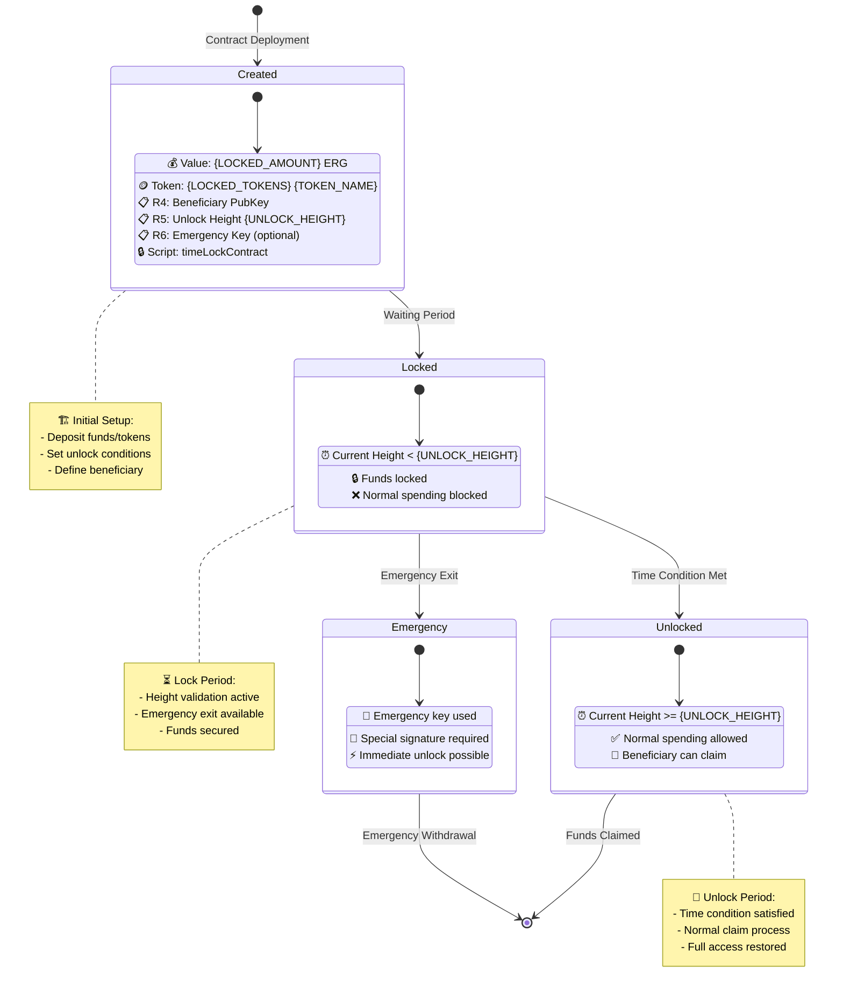

# Ergo Smart Contract Diagram Generator

This document provides a systematic approach to generating Mermaid diagrams for any Ergo smart contract pattern.

## Pattern-Based Template System

### 1. DEX Contract Pattern

```mermaid
graph TB
    %% Template for DEX-style contracts
    subgraph "🏪 DEX Order Lifecycle"
        direction TB
        
        %% Buy Order Creation
        B[Buyer 👤<br/>💰 {BUYER_ERG} ERG] --> BCT{Create Buy Order<br/>📝 Fee: {ORDER_FEE}}
        BCT --> BO[Buy Order Box 📦<br/>💰 {ORDER_VALUE} ERG<br/>📋 R4: BoxId Link<br/>🎯 Target: {TOKEN_AMOUNT} {TOKEN_NAME}<br/>💎 Price: {TOKEN_PRICE} ERG/token<br/>🔒 Script: buyerContract]
        
        %% Sell Order Creation  
        S[Seller 👤<br/>💰 {SELLER_ERG} ERG<br/>🪙 {SELL_TOKENS} {TOKEN_NAME}] --> SCT{Create Sell Order<br/>📝 Fee: {ORDER_FEE}}
        SCT --> SO[Sell Order Box 📦<br/>💰 {SELL_ORDER_VALUE} ERG<br/>🪙 {SELL_TOKENS} {TOKEN_NAME}<br/>📋 R4: BoxId Link<br/>💎 Price: {SELL_PRICE} ERG/token<br/>🔒 Script: sellerContract]
        
        %% Matching Transaction
        BO --> MT{Order Matching<br/>⚖️ DEX Operator<br/>📝 Fee: {MATCH_FEE}}
        SO --> MT
        
        %% Partial Match Outputs
        MT --> NBO[New Buy Order 📦<br/>💰 {REMAINING_BUY_ERG} ERG<br/>📋 R4: Previous BoxId<br/>🎯 Remaining: {REMAINING_BUY_TOKENS}<br/>🔒 Script: buyerContract]
        
        MT --> NSO[New Sell Order 📦<br/>💰 {REMAINING_SELL_ERG} ERG<br/>🪙 {REMAINING_SELL_TOKENS} {TOKEN_NAME}<br/>📋 R4: Previous BoxId<br/>🔒 Script: sellerContract]
        
        %% Settlement Boxes
        MT --> SB[Seller Payout 📦<br/>💰 {SELLER_PAYOUT} ERG<br/>🔒 Script: sellerPk]
        
        MT --> BB[Buyer Tokens 📦<br/>💰 {BUYER_CHANGE} ERG<br/>🪙 {BOUGHT_TOKENS} {TOKEN_NAME}<br/>🔒 Script: buyerPk]
        
        MT --> DF[DEX Fee Box 📦<br/>💰 {DEX_FEE} ERG<br/>🔒 Script: dexPk]
    end
    
    %% Styling
    classDef participantStyle fill:#e3f2fd,stroke:#1976d2,stroke-width:2px
    classDef orderStyle fill:#fff8e1,stroke:#f57c00,stroke-width:2px  
    classDef transactionStyle fill:#e8f5e8,stroke:#388e3c,stroke-width:3px
    classDef payoutStyle fill:#f3e5f5,stroke:#7b1fa2,stroke-width:2px
    
    class B,S participantStyle
    class BO,SO,NBO,NSO orderStyle
    class BCT,SCT,MT transactionStyle
    class SB,BB,DF payoutStyle
```

### 2. Escrow Contract Pattern

```mermaid
graph TD
    %% Template for escrow-style contracts
    subgraph "🤝 Escrow Service Lifecycle"
        direction TB
        
        %% Initial Setup
        BU[Buyer 👤<br/>💰 {BUYER_FUNDS} ERG] --> ET{Create Escrow<br/>📝 Fee: {ESCROW_FEE}}
        SE[Seller 👤<br/>🪙 {ITEM_TOKENS} {ITEM_NAME}] --> ET
        AR[Arbitrator 👤<br/>🔑 Dispute Resolution Key] --> ET
        
        ET --> EB[Escrow Box 📦<br/>💰 {ESCROW_VALUE} ERG<br/>🪙 {ITEM_TOKENS} {ITEM_NAME}<br/>📋 R4: Buyer PubKey<br/>📋 R5: Seller PubKey<br/>📋 R6: Arbitrator PubKey<br/>📋 R7: Timeout Height<br/>📋 R8: Item Description Hash<br/>🔒 Script: escrowContract]
        
        %% Success Path
        EB --> SP{Successful Delivery<br/>✅ Both parties agree}
        SP --> SPB[Seller Payment 📦<br/>💰 {SELLER_PAYMENT} ERG<br/>🔒 Script: sellerPk]
        SP --> BIB[Buyer Item 📦<br/>🪙 {ITEM_TOKENS} {ITEM_NAME}<br/>💰 {BUYER_CHANGE} ERG<br/>🔒 Script: buyerPk]
        
        %% Dispute Path  
        EB --> DP{Dispute Raised<br/>⚖️ Arbitrator decides}
        DP --> DRB[Dispute Resolution<br/>🏛️ Arbitrator signature required]
        DRB --> WSB[Winner Settlement 📦<br/>💰 {WINNER_AMOUNT} ERG<br/>🪙 {DISPUTED_TOKENS} {ITEM_NAME}<br/>🔒 Script: winnerPk]
        DRB --> AFB[Arbitrator Fee 📦<br/>💰 {ARB_FEE} ERG<br/>🔒 Script: arbitratorPk]
        
        %% Timeout Path
        EB --> TP{Timeout Reached<br/>⏰ Block height > R7}
        TP --> RFB[Refund Box 📦<br/>💰 {REFUND_AMOUNT} ERG<br/>🔒 Script: buyerPk]
        TP --> RTB[Return Item 📦<br/>🪙 {ITEM_TOKENS} {ITEM_NAME}<br/>🔒 Script: sellerPk]
    end
    
    %% Styling
    classDef participantStyle fill:#e3f2fd,stroke:#1976d2,stroke-width:2px
    classDef escrowStyle fill:#fff8e1,stroke:#f57c00,stroke-width:2px
    classDef successStyle fill:#e8f5e8,stroke:#388e3c,stroke-width:2px
    classDef disputeStyle fill:#fff3e0,stroke:#ff9800,stroke-width:2px
    classDef timeoutStyle fill:#ffebee,stroke:#f44336,stroke-width:2px
    
    class BU,SE,AR participantStyle
    class EB escrowStyle
    class SP,SPB,BIB successStyle
    class DP,DRB,WSB,AFB disputeStyle
    class TP,RFB,RTB timeoutStyle
```

### 3. Time-Locked Contract Pattern



## Dynamic Template Generator

### Template Variables Reference

| Pattern Type | Variables | Description |
|-------------|-----------|-------------|
| **DEX** | `{BUYER_ERG}`, `{SELLER_ERG}`, `{TOKEN_AMOUNT}`, `{TOKEN_NAME}`, `{TOKEN_PRICE}`, `{ORDER_FEE}`, `{MATCH_FEE}`, `{DEX_FEE}` | Order matching parameters |
| **Escrow** | `{BUYER_FUNDS}`, `{ITEM_TOKENS}`, `{ITEM_NAME}`, `{ESCROW_VALUE}`, `{SELLER_PAYMENT}`, `{ARB_FEE}`, `{TIMEOUT_HEIGHT}` | Escrow service parameters |
| **TimeLock** | `{LOCKED_AMOUNT}`, `{LOCKED_TOKENS}`, `{TOKEN_NAME}`, `{UNLOCK_HEIGHT}`, `{BENEFICIARY}`, `{EMERGENCY_KEY}` | Time-based lock parameters |

### Usage Examples

#### Generate DEX Diagram:
```javascript
const dexParams = {
  BUYER_ERG: "500",
  SELLER_ERG: "50", 
  TOKEN_AMOUNT: "100",
  TOKEN_NAME: "GOLD",
  TOKEN_PRICE: "5",
  ORDER_FEE: "0.001",
  MATCH_FEE: "0.001", 
  DEX_FEE: "1"
};

const dexDiagram = generateDiagram("DEX", dexParams);
```

#### Generate Escrow Diagram:
```javascript
const escrowParams = {
  BUYER_FUNDS: "1000",
  ITEM_TOKENS: "1",
  ITEM_NAME: "RealEstateNFT",
  ESCROW_VALUE: "1000",
  SELLER_PAYMENT: "950",
  ARB_FEE: "50",
  TIMEOUT_HEIGHT: "1000000"
};

const escrowDiagram = generateDiagram("ESCROW", escrowParams);
```

## Contract-Specific Customization Guide

### For New Contract Types:

1. **Identify Core Pattern**:
   - Multi-party transaction (use DEX template)
   - Trust-minimized exchange (use Escrow template)  
   - Time-based conditions (use TimeLock template)
   - Token sales (use existing Token Sales template)

2. **Map Contract Elements**:
   - Parties involved → Participant nodes
   - Contract states → Box states
   - Validation logic → Decision trees
   - Value flows → Transaction paths

3. **Customize Variables**:
   - Replace template placeholders
   - Add contract-specific registers
   - Include relevant token types
   - Set appropriate fee structures

4. **Add Contract Logic**:
   - Include ErgoScript conditions
   - Map guard conditions
   - Show fallback paths
   - Document success/failure scenarios

## Integration with Development Workflow

### Documentation Generation:
```bash
# Generate diagrams for all contracts in project
./generate-diagrams.sh src/main/scala/contracts/

# Generate specific contract diagram
./generate-diagram.sh DEX contracts/DEXContract.scala
```

### Interactive Documentation:
- Embed in markdown files
- Link to Scastie playgrounds  
- Include in API documentation
- Generate for GitHub wikis

### Testing Integration:
- Visual test case documentation
- Scenario coverage diagrams
- State transition testing
- Edge case visualization

This system provides a comprehensive foundation for documenting and visualizing any Ergo smart contract pattern with consistent, professional diagrams.