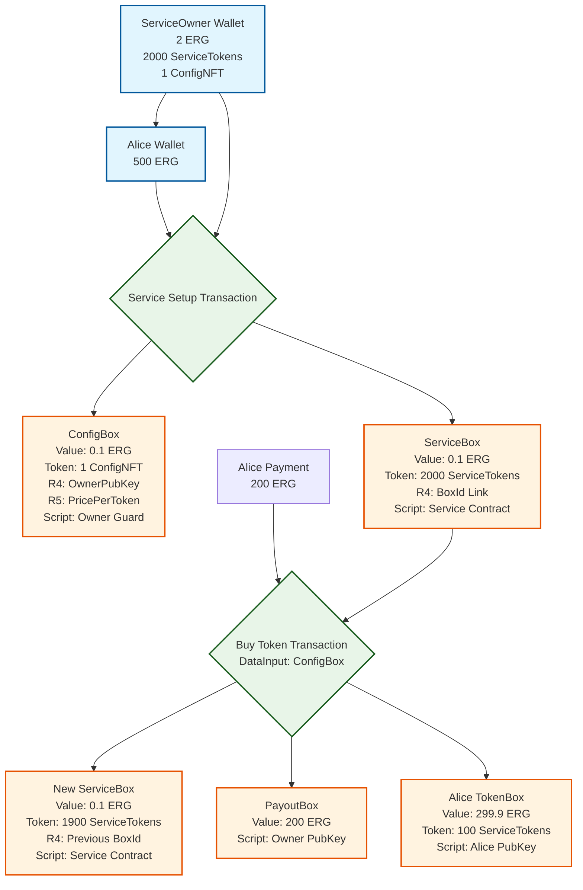
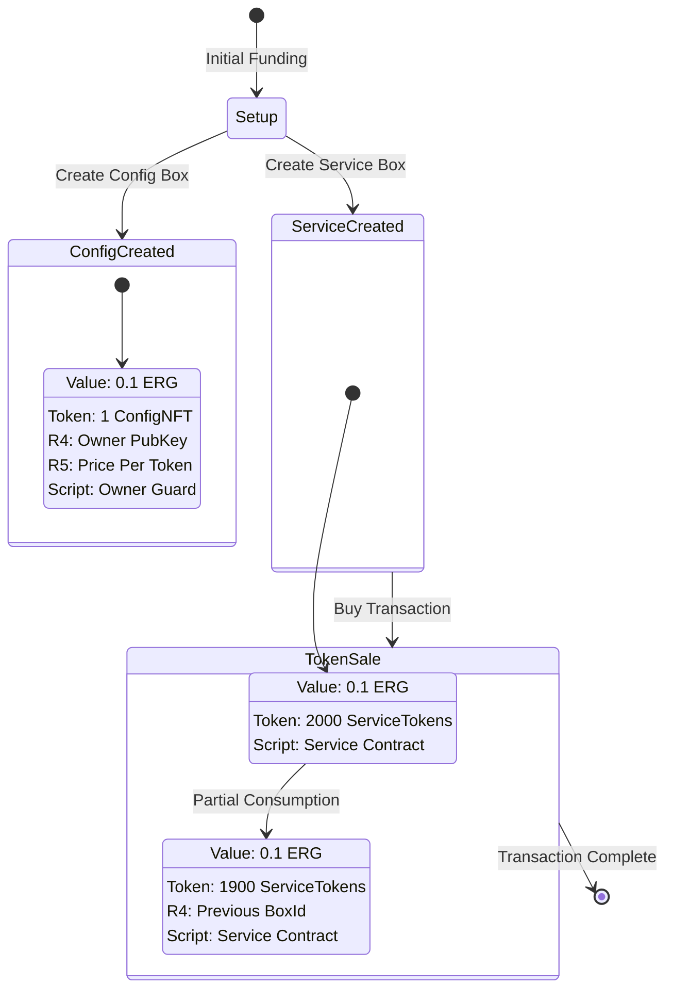
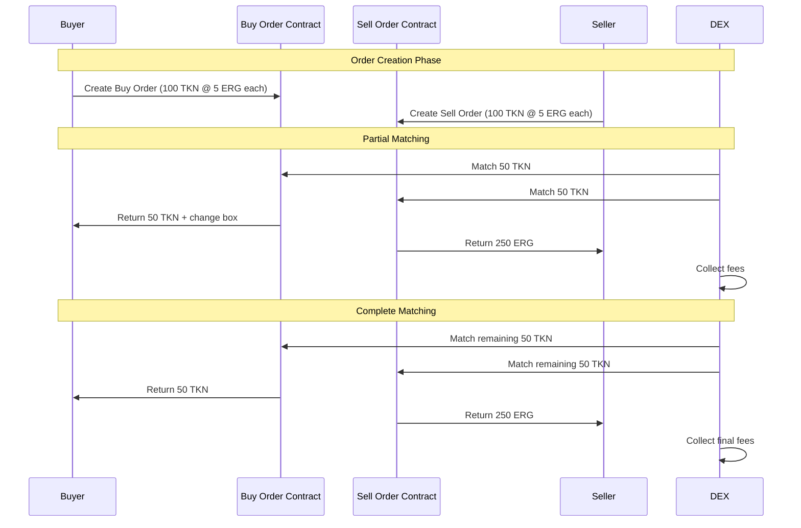
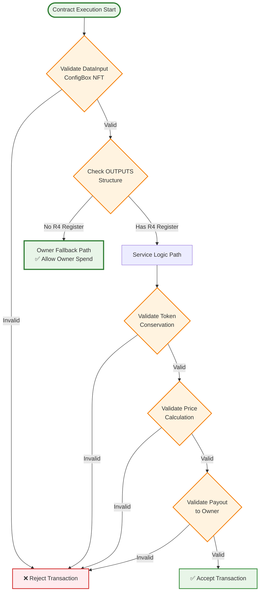
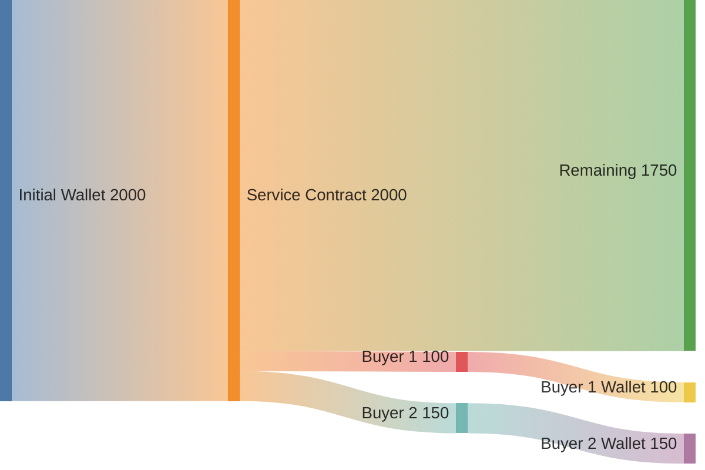
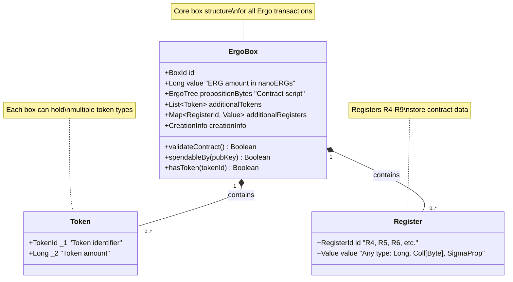

# Ergo Smart Contract Mermaid Templates

This document provides comprehensive Mermaid diagram templates optimized for visualizing Ergo blockchain smart contracts and transactions.

## Core Pattern Templates

### 1. Multi-Party Transaction Flow

### 2. Box State Transition Pattern

### 3. DEX Order Matching Flow

### 4. Contract Logic Decision Tree

### 5. Token Flow Visualization

### 6. Ergo Box Anatomy

## Template Usage Guide

### For Multi-Party Contracts:
1. Copy the Multi-Party Transaction Flow template
2. Replace party names (ServiceOwner, Alice) with actual participants
3. Update box values, tokens, and register contents
4. Modify contract logic descriptions

### For State Machines:
1. Use the Box State Transition Pattern
2. Define all possible states
3. Add transition conditions
4. Include register and token changes

### For DEX-style Applications:
1. Start with DEX Order Matching Flow
2. Customize participant roles
3. Add specific token/price information
4. Include fee calculations

### For Contract Logic:
1. Use Contract Logic Decision Tree
2. Map out all validation paths
3. Add specific ErgoScript conditions
4. Include success/failure outcomes

## Styling Guidelines

### Color Scheme:
- **Wallets/Parties**: Light blue (`#e1f5fe`, `#01579b`)
- **Contracts/Boxes**: Light purple (`#f3e5f5`, `#4a148c`)
- **Transactions**: Light green (`#e8f5e8`, `#1b5e20`)
- **Success States**: Green (`#e8f5e8`, `#388e3c`)
- **Error States**: Red (`#ffebee`, `#d32f2f`)
- **Decisions**: Orange (`#fff3e0`, `#f57c00`)

### Best Practices:
1. Keep diagrams focused on single concepts
2. Use consistent naming conventions
3. Include actual values when possible
4. Add clear labels for all components
5. Use subgraphs for complex structures
6. Include both happy path and error scenarios

## Integration with Documentation

These templates can be embedded in:
- Smart contract documentation
- Tutorial materials
- Code examples in ergoscript-by-example/
- API documentation
- Architecture design documents

Each template is designed to be:
- **Modular**: Combine multiple templates
- **Extensible**: Add project-specific elements
- **Interactive**: Clickable elements where supported
- **Educational**: Clear for learning ErgoScript patterns