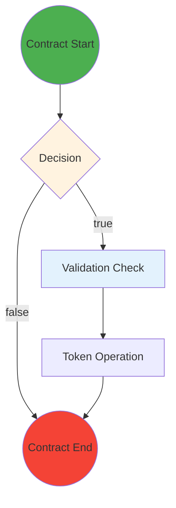

# ErgoScript Contract Flow Analyzer

A Rust-based specialized analyzer that can interpret ErgoScript contracts and extract visual flow patterns for diagram generation.

## Features

- **Parse ErgoScript Contract Logic**: Extract conditional branches (`if`, `else`, `allOf`, `anyOf`)
- **Identify Validation Patterns**: Box properties, token checks, register validations
- **Map Guard Script Patterns**: Detect `ownerPk || contractLogic` patterns
- **Detect Data Input Dependencies**: Analyze context and data input usage
- **Analyze Transaction Flow Patterns**: Input/Output box relationships
- **Token Flow Analysis**: Minting, burning, transfers
- **ERG Value Transformations**: Value flow tracking
- **Register Data Propagation**: Data flow between boxes
- **Extract Diagram Elements**: Party identification, contract states, validation checkpoints
- **Multiple Output Formats**: JSON, YAML, Mermaid diagrams

## Supported Contract Patterns

- **Guard Script**: Owner bypass pattern (`ownerPk || contractLogic`)
- **DEX**: Decentralized exchange functionality
- **Escrow**: Third-party mediated transactions  
- **Time Lock**: Time-based access control
- **Atomic Swap**: Cross-chain atomic exchanges
- **Token Sale**: Token distribution mechanisms
- **Refund**: Fund recovery mechanisms
- **Self-Replicating**: State-preserving contracts
- **Oracle**: External data integration

## Installation

### As a Library

Add to your `Cargo.toml`:

```toml
[dependencies]
ergoscript-analyzer = "0.1.0"
```

### As a CLI Tool

```bash
cargo install ergoscript-analyzer
```

### From Source

```bash
git clone <repository-url>
cd ergoscript-analyzer
cargo build --release
```

## Usage

### Library Usage

```rust
use ergoscript_analyzer::{ErgoScriptAnalyzer, OutputFormat};

// Create analyzer
let analyzer = ErgoScriptAnalyzer::new();

// Analyze contract
let contract_code = r#"
{
  val configBox = CONTEXT.dataInputs(0)
  val validConfigBox = configBox.tokens(0)._1 == configBoxNFTId
  if (validConfigBox) {
    val ownerScript = configBox.R4[SigmaProp].get
    ownerScript
  } else {
    sigmaProp(false)
  }
}
"#;

// Perform analysis
let analysis = analyzer.analyze(contract_code)?;

// Generate diagram
let diagram = analyzer.generate_diagram(&analysis)?;

// Output in different formats
println!("JSON: {}", diagram.to_json()?);
println!("Mermaid: {}", diagram.to_mermaid());
```

### CLI Usage

#### Analyze a Single Contract

```bash
# Analyze from file
ergo-analyzer analyze contract.es

# Analyze from string with output to file
ergo-analyzer analyze "sigmaProp(true)" -o result.json

# Generate diagram in Mermaid format
ergo-analyzer analyze contract.es --diagram --format mermaid -o diagram.mmd

# Show only identified patterns
ergo-analyzer analyze contract.es --patterns-only
```

#### Validate Contract

```bash
# Basic validation
ergo-analyzer validate contract.es

# Strict validation mode
ergo-analyzer validate contract.es --strict

# Output validation report
ergo-analyzer validate contract.es -o validation_report.txt
```

#### Batch Analysis

```bash
# Analyze all .es files in directory
ergo-analyzer batch ./contracts

# With custom output directory and format
ergo-analyzer batch ./contracts -o ./analysis_results -f yaml

# Generate summary report
ergo-analyzer batch ./contracts --summary
```

#### List Supported Patterns

```bash
# List all patterns
ergo-analyzer patterns

# Show detailed descriptions
ergo-analyzer patterns --detailed
```

## Configuration Options

```rust
use ergoscript_analyzer::{ErgoScriptAnalyzer, AnalyzerConfig, OutputFormat};

let config = AnalyzerConfig {
    enable_pattern_detection: true,
    enable_flow_analysis: true, 
    enable_diagram_generation: true,
    output_format: OutputFormat::Json,
    include_debug_info: false,
    max_recursion_depth: 100,
};

let analyzer = ErgoScriptAnalyzer::with_config(config);
```

## Example Contracts

### Token Sales Service

```scala
{
  val configBox = CONTEXT.dataInputs(0)
  val validConfigBox = configBox.tokens(0)._1 == configBoxNFTId
  val defined = OUTPUTS(0).tokens.size > 0 && OUTPUTS(0).R4[Coll[Byte]].isDefined

  if (validConfigBox && defined) {
    val ownerScript = configBox.R4[SigmaProp].get
    val priceOfServiceToken = configBox.R5[Long].get
    sigmaProp (if (defined) {
      val inServiceToken = SELF.tokens(0)
      val outServiceToken = OUTPUTS(0).tokens(0)
      val outValue: Long = ((inServiceToken._2 - outServiceToken._2) * priceOfServiceToken).toLong
      allOf(Coll(
          inServiceToken._1 == serviceTokenId,
          outServiceToken._1 == serviceTokenId,
          OUTPUTS(0).propositionBytes == SELF.propositionBytes,
          OUTPUTS(0).R4[Coll[Byte]].get == SELF.id,
          OUTPUTS(1).value >= outValue,
          OUTPUTS(1).propositionBytes == ownerScript.propBytes
          ))
    } else { false } )
  }
  else if (validConfigBox) {
    val ownerScript = configBox.R4[SigmaProp].get
    ownerScript
  }
  else {sigmaProp (false)}
}
```

**Analysis Result:**
- Patterns: TokenSale, GuardScript, Refund
- Validation Checks: 6 checks (tokens, values, registers)
- Token Operations: 2 operations (input/output token validation)
- Conditional Paths: 3 paths (main, guard, fallback)

### Simple Guard Contract

```scala
ownerPk || sigmaProp(OUTPUTS(0).value >= 1000)
```

**Analysis Result:**
- Patterns: GuardScript
- Validation Checks: 1 check (value validation)  
- Conditional Paths: 1 path (owner bypass)

## Output Formats

### JSON Analysis Output

```json
{
  "contract": {
    "metadata": {
      "identified_patterns": ["TokenSale", "GuardScript"],
      "name": null,
      "description": null,
      "version": null
    }
  },
  "flow_patterns": [...],
  "validation_checks": [...],
  "party_interactions": [...],
  "token_operations": [...],
  "erg_flows": [...],
  "conditional_paths": [...]
}
```

### Mermaid Diagram Output



## Advanced Features

### Contract Validation

```rust
let validation = analyzer.validate_contract(&analysis);

if !validation.is_valid {
    println!("Issues found:");
    for issue in &validation.issues {
        println!("  ❌ {}", issue);
    }
}

if !validation.suggestions.is_empty() {
    println!("Suggestions:");
    for suggestion in &validation.suggestions {
        println!("  💡 {}", suggestion);
    }
}
```

### Batch Processing

```rust
use ergoscript_analyzer::utils;

let analyzer = ErgoScriptAnalyzer::new();
let file_paths = vec!["contract1.es", "contract2.es", "contract3.es"];

let analyses = utils::batch_analyze(&analyzer, &file_paths)?;
let report = utils::generate_batch_report(&analyses);

println!("Analyzed {} contracts", report.total_contracts);
println!("Pattern frequency:");
for (pattern, count) in &report.pattern_frequency {
    println!("  {:?}: {} contracts", pattern, count);
}
```

### Contract Comparison  

```rust
use ergoscript_analyzer::utils;

let comparison = utils::compare_contracts(&analysis1, &analysis2);

println!("Common patterns: {:?}", comparison.common_patterns);
println!("Unique to first: {:?}", comparison.unique_to_first);
println!("Unique to second: {:?}", comparison.unique_to_second);
```

## Error Handling

The analyzer provides detailed error information:

```rust
match analyzer.analyze(contract_code) {
    Ok(analysis) => { /* Process analysis */ },
    Err(AnalyzerError::LexingError { source }) => {
        eprintln!("Tokenization failed: {}", source);
    },
    Err(AnalyzerError::ParsingError { source }) => {
        eprintln!("Parsing failed: {}", source);
    },
    Err(AnalyzerError::AnalysisError { source }) => {
        eprintln!("Analysis failed: {}", source);
    },
    Err(e) => {
        eprintln!("Other error: {}", e);
    }
}
```

## Performance

The analyzer is designed for performance:

- **Fast parsing**: Efficient nom-based parser
- **Memory efficient**: Minimal allocations during analysis
- **Parallel processing**: Batch analysis support
- **Configurable depth**: Adjustable recursion limits

### Benchmarks

Run benchmarks with:

```bash
cargo bench
```

Typical performance on modern hardware:
- Simple contracts: < 1ms analysis time
- Medium contracts: 1-5ms analysis time  
- Complex contracts: 5-20ms analysis time
- Diagram generation: 2-10ms additional time

## Integration

### With Mermaid

```bash
# Generate Mermaid diagram
ergo-analyzer analyze contract.es --diagram --format mermaid -o contract.mmd

# Render with Mermaid CLI
mmdc -i contract.mmd -o contract.png
```

### With Web Applications

```javascript
// Fetch analysis from Rust backend
const response = await fetch('/api/analyze', {
    method: 'POST',
    headers: { 'Content-Type': 'application/json' },
    body: JSON.stringify({ contract: contractCode })
});

const analysis = await response.json();

// Render diagram with D3.js or similar
renderDiagram(analysis.diagram);
```

### With Documentation Generation

```bash
# Generate documentation with embedded diagrams
ergo-analyzer batch ./contracts --format all -o ./docs
```

## Contributing

1. Fork the repository
2. Create a feature branch: `git checkout -b my-feature`
3. Make your changes with tests
4. Run tests: `cargo test`
5. Run benchmarks: `cargo bench`
6. Submit a pull request

### Development Setup

```bash
git clone <repository-url>
cd ergoscript-analyzer
cargo build
cargo test
cargo bench
```

## License

This project is licensed under the MIT License - see the LICENSE file for details.

## Acknowledgments

- Ergo Platform team for ErgoScript specification
- Rust community for excellent parsing libraries
- Contributors to the Ergo ecosystem

## Changelog

### v0.1.0
- Initial release
- Basic ErgoScript parsing and analysis
- Pattern detection for common contract types
- Diagram generation in multiple formats
- CLI interface with batch processing
- Comprehensive test suite and benchmarks