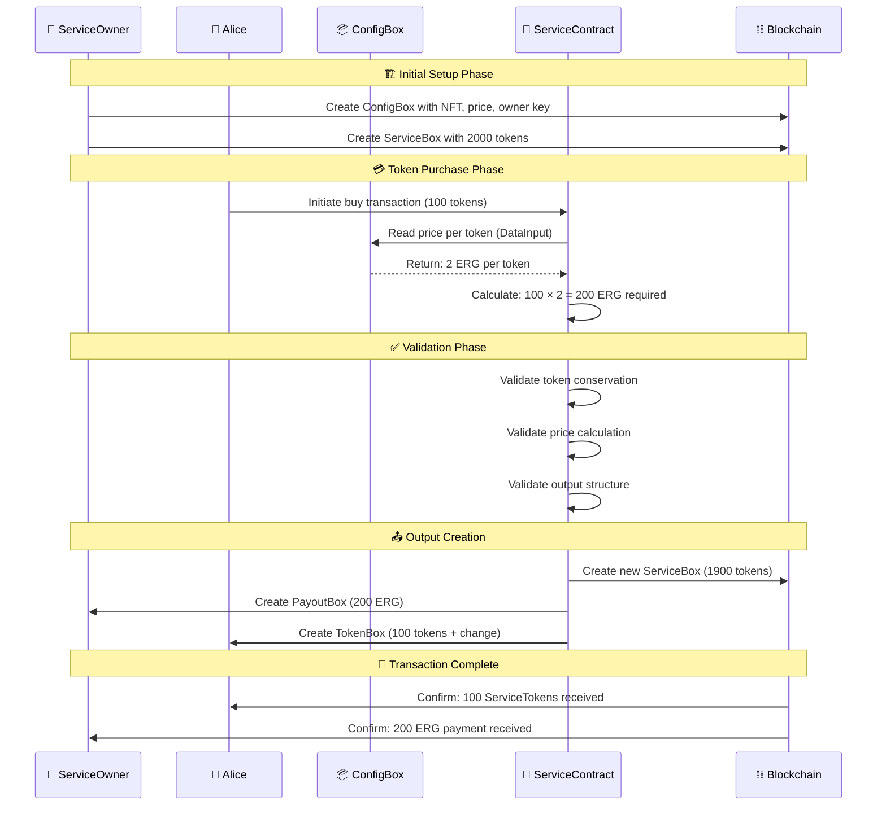
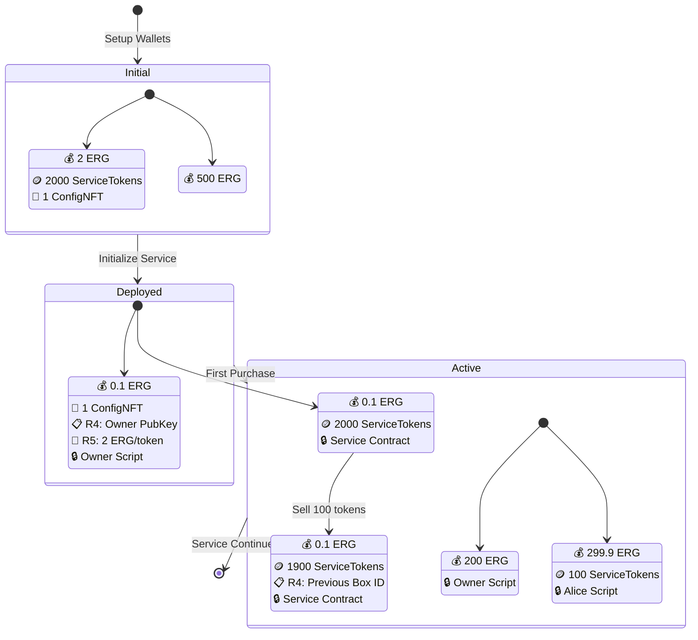
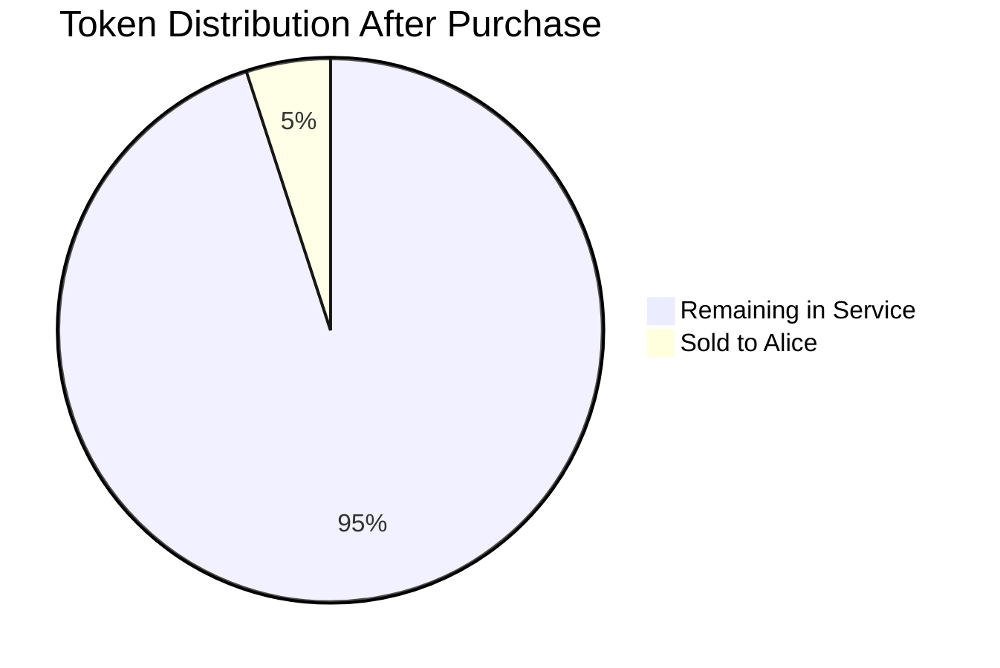
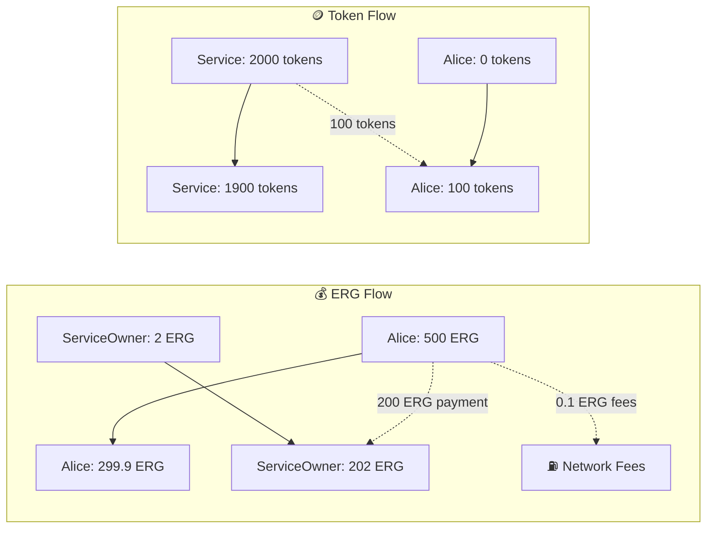

# Token Sales Service - Complete Mermaid Diagrams

This document provides comprehensive Mermaid diagrams for the Token Sales Service smart contract, improving upon the reference PNG with interactive, modular visualizations.

## 1. Complete System Overview

```mermaid
graph TB
    %% Initial Setup Phase
    subgraph "Phase 1: Initial Setup"
        direction TB
        SO[ServiceOwner Wallet<br/>💰 2 ERG<br/>🪙 2000 ServiceTokens<br/>🎫 1 ConfigNFT]
        A[Alice Wallet<br/>💰 500 ERG]
    end
    
    %% Service Initialization Transaction
    subgraph "Phase 2: Service Initialization"
        direction TB
        SO --> IST{Init Service Transaction<br/>📝 Fee: 0.001 ERG}
        A --> IST
        
        IST --> CB[ConfigBox 📦<br/>💰 Value: 0.1 ERG<br/>🎫 Token: 1 ConfigNFT<br/>📋 R4: ServiceOwner PubKey<br/>💎 R5: 2 ERG (price per token)<br/>🔒 Script: serviceOwnerPk]
        
        IST --> SB1[ServiceBox v1 📦<br/>💰 Value: 0.1 ERG<br/>🪙 Token: 2000 ServiceTokens<br/>🔒 Script: serviceContract]
    end
    
    %% Token Purchase Transaction
    subgraph "Phase 3: Token Purchase"
        direction TB
        AF[Alice Funds<br/>💰 200 ERG for 100 tokens]
        
        AF --> BTT{Buy Token Transaction<br/>📝 Fee: 0.001 ERG<br/>📊 DataInput: ConfigBox}
        SB1 --> BTT
        CB -.->|DataInput<br/>(not consumed)| BTT
        
        BTT --> SB2[ServiceBox v2 📦<br/>💰 Value: 0.1 ERG<br/>🪙 Token: 1900 ServiceTokens<br/>📋 R4: Previous Box ID<br/>🔒 Script: serviceContract]
        
        BTT --> PB[PayoutBox 📦<br/>💰 Value: 200 ERG<br/>🔒 Script: serviceOwnerPk]
        
        BTT --> ATB[Alice TokenBox 📦<br/>💰 Value: 299.9 ERG (change)<br/>🪙 Token: 100 ServiceTokens<br/>🔒 Script: alicePk]
    end
    
    %% Final State
    subgraph "Phase 4: Final State"
        direction TB
        SOF[ServiceOwner Final<br/>💰 2 ERG + 200 ERG<br/>🪙 0 ServiceTokens<br/>🎫 1 ConfigNFT]
        AF2[Alice Final<br/>💰 299.9 ERG<br/>🪙 100 ServiceTokens]
    end
    
    PB --> SOF
    CB --> SOF
    ATB --> AF2
    
    %% Styling
    classDef walletStyle fill:#e3f2fd,stroke:#1976d2,stroke-width:2px,color:#000
    classDef boxStyle fill:#fff8e1,stroke:#f57c00,stroke-width:2px,color:#000
    classDef transactionStyle fill:#e8f5e8,stroke:#388e3c,stroke-width:3px,color:#000
    classDef dataInputStyle fill:#f3e5f5,stroke:#7b1fa2,stroke-width:2px,stroke-dasharray: 5 5
    
    class SO,A,AF,SOF,AF2 walletStyle
    class CB,SB1,SB2,PB,ATB boxStyle
    class IST,BTT transactionStyle
```

## 2. Contract Logic Flow

```mermaid
graph TD
    Start([🚀 Contract Execution Start]) --> DataInputCheck{🔍 Validate DataInput<br/>ConfigBox has ConfigNFT?}
    
    DataInputCheck -->|❌ Invalid NFT| Reject[🚫 Reject Transaction]
    DataInputCheck -->|✅ Valid NFT| OutputCheck{📋 Check OUTPUTS(0)<br/>Has R4 register?}
    
    OutputCheck -->|❌ No R4| OwnerPath[👤 Owner Fallback Path<br/>Check: configBox.R4.ownerScript]
    OutputCheck -->|✅ Has R4| ServicePath[🛍️ Service Logic Path]
    
    OwnerPath --> OwnerValid{✅ Owner signature valid?}
    OwnerValid -->|❌| Reject
    OwnerValid -->|✅| Accept[✅ Accept Transaction]
    
    ServicePath --> TokenValidation{🪙 Token Conservation<br/>Check: inServiceToken == outServiceToken}
    TokenValidation -->|❌| Reject
    TokenValidation -->|✅| PriceValidation
    
    PriceValidation{💰 Price Calculation<br/>outValue = (sold tokens) × price}
    PriceValidation -->|❌| Reject
    PriceValidation -->|✅| BoxValidation
    
    BoxValidation{📦 Box Requirements<br/>• Same contract script<br/>• Correct box ID linking<br/>• Payout to owner}
    BoxValidation -->|❌| Reject
    BoxValidation -->|✅| Accept
    
    %% Styling with emojis
    classDef startEnd fill:#c8e6c9,stroke:#4caf50,stroke-width:3px
    classDef decision fill:#fff3e0,stroke:#ff9800,stroke-width:2px
    classDef success fill:#e8f5e8,stroke:#388e3c,stroke-width:3px
    classDef reject fill:#ffebee,stroke:#f44336,stroke-width:3px
    classDef process fill:#e1f5fe,stroke:#2196f3,stroke-width:2px
    
    class Start startEnd
    class DataInputCheck,OutputCheck,OwnerValid,TokenValidation,PriceValidation,BoxValidation decision
    class Accept success
    class Reject reject
    class OwnerPath,ServicePath process
```

## 3. Data Flow Sequence



## 4. Box State Evolution



## 5. ErgoScript Code Visualization

```mermaid
graph LR
    subgraph "🔍 DataInput Validation"
        DI[DataInput: configBox<br/>🎫 Check NFT ID<br/>📊 Extract price & owner]
    end
    
    subgraph "🛡️ Guard Conditions" 
        GC1[validConfigBox &&<br/>OUTPUTS(0).R4.isDefined]
        GC2[validConfigBox only]
        GC3[Invalid config]
    end
    
    subgraph "🛍️ Service Logic Path"
        SL1[📋 Read owner script from R4]
        SL2[💰 Read price from R5]  
        SL3[🪙 Calculate token difference]
        SL4[💱 Calculate required ERG]
        SL5[✅ Validate all conditions]
    end
    
    subgraph "👤 Owner Fallback Path"
        OF1[🔑 Use owner signature]
    end
    
    subgraph "❌ Reject Path"
        RP1[🚫 Return false]
    end
    
    DI --> GC1
    DI --> GC2  
    DI --> GC3
    
    GC1 --> SL1
    SL1 --> SL2
    SL2 --> SL3
    SL3 --> SL4
    SL4 --> SL5
    
    GC2 --> OF1
    GC3 --> RP1
    
    %% Styling
    classDef validation fill:#e3f2fd,stroke:#1976d2,stroke-width:2px
    classDef logic fill:#f3e5f5,stroke:#7b1fa2,stroke-width:2px
    classDef fallback fill:#fff3e0,stroke:#f57c00,stroke-width:2px
    classDef reject fill:#ffebee,stroke:#d32f2f,stroke-width:2px
    
    class DI validation
    class GC1,GC2,GC3 validation
    class SL1,SL2,SL3,SL4,SL5 logic
    class OF1 fallback
    class RP1 reject
```

## 6. Token Economics Flow





## Template Usage

These diagrams can be customized for other Ergo smart contracts by:

1. **Replacing participants**: Change ServiceOwner/Alice to relevant parties
2. **Updating values**: Modify ERG amounts, token quantities, prices
3. **Adjusting logic**: Customize validation conditions and contract paths
4. **Adding scenarios**: Include refund paths, multiple buyers, price updates

Each diagram focuses on a specific aspect:
- **Overview**: Complete transaction flow
- **Logic**: Contract validation paths  
- **Sequence**: Temporal interaction flow
- **State**: Box evolution over time
- **Code**: ErgoScript structure
- **Economics**: Value and token transfers

The modular design allows combining diagrams for comprehensive documentation or using individual diagrams for focused explanations.